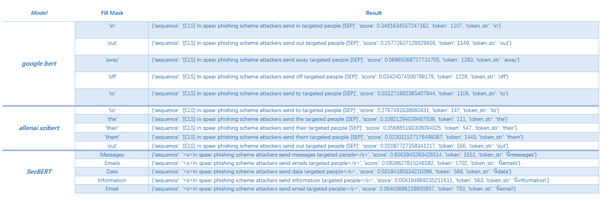

<!--
 * @Author: Kun
 * @Date: 2020-11-24 22:58:24
 * @LastEditTime: 2023-04-29 06:12:28
 * @LastEditors: Kun
 * @Description: 
 * @FilePath: /my_open_projects/SecBERT/README.md
-->
# <p align=center>**`SecBERT`**</p>

[](https://github.com/jackaduma/SecBERT)
[](https://paypal.me/jackaduma?locale.x=zh_XC)

[**中文说明**](./README.zh-CN.md) | [**English**](./README.md)

`SecBERT` is a `BERT` model trained on cyber security text, learned CyberSecurity Knowledge.

* `SecBERT` is trained on papers from the corpus of 
  
  * [APTnotes](https://github.com/kbandla/APTnotes)
  
  * [Stucco-Data: Cyber security data sources](https://stucco.github.io/data/)  
  
  * [CASIE: Extracting Cybersecurity Event Information from Text](https://ebiquity.umbc.edu/_file_directory_/papers/943.pdf)
  
  * [SemEval-2018 Task 8: Semantic Extraction from CybersecUrity REports using Natural Language Processing (SecureNLP)](https://competitions.codalab.org/competitions/17262). 

* `SecBERT` has its own vocabulary (`secvocab`) that's built to best match the training corpus. We trained [SecBERT](https://huggingface.co/jackaduma/SecBERT)  and [SecRoBERTa](https://huggingface.co/jackaduma/SecRoBERTa) versions.


## **Table of Contents**


## **Downloading Trained Models**

SecBERT models now installable directly within Huggingface's framework:

```
from transformers import AutoTokenizer, AutoModelForMaskedLM

tokenizer = AutoTokenizer.from_pretrained("jackaduma/SecBERT")

model = AutoModelForMaskedLM.from_pretrained("jackaduma/SecBERT")


tokenizer = AutoTokenizer.from_pretrained("jackaduma/SecRoBERTa")

model = AutoModelForMaskedLM.from_pretrained("jackaduma/SecRoBERTa")

```

------

## **Pretrained-Weights** 

We release the the pytorch version of the trained models. The pytorch version is created using the [Hugging Face](https://github.com/huggingface/pytorch-pretrained-BERT) library, and this repo shows how to use it.

[Huggingface Modelhub](https://huggingface.co/models)

  * [SecBert](https://huggingface.co/jackaduma/SecBERT)

  * [SecRoBERTa](https://huggingface.co/jackaduma/SecRoBERTa)


### **Using SecBERT in your own model**

SecBERT models include all necessary files to be plugged in your own model and are in same format as BERT.

If you use PyTorch, refer to [Hugging Face's repo](https://github.com/huggingface/pytorch-pretrained-BERT) where detailed instructions on using BERT models are provided. 


## **Fill Mask**

We proposed to build language model which work on cyber security text, as result, it can improve downstream tasks (NER, Text Classification, Semantic Understand, Q&A) in Cyber Security Domain.

First, as below shows Fill-Mask pipeline in [Google Bert](), [AllenAI SciBert](https://github.com/allenai/scibert) and our [SecBERT](https://github.com/jackaduma/SecBERT) .

```
cd lm
python eval_fillmask_lm.py
```




## **Downstream-tasks** 

### TODO


------
## **Star-History**


------

## Donation
If this project help you reduce time to develop, you can give me a cup of coffee :) 

AliPay(支付宝)
<div align="center">
	
</div>

WechatPay(微信)
<div align="center">
    
</div>

------

## **License**

[MIT](LICENSE) © Kun